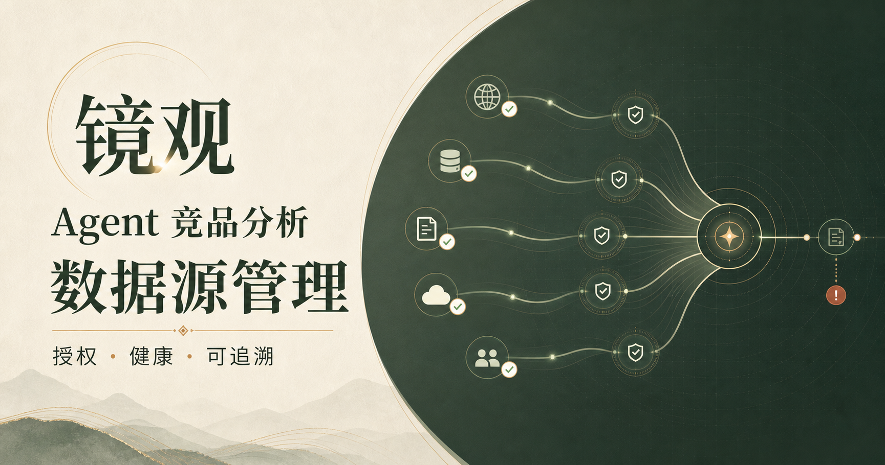
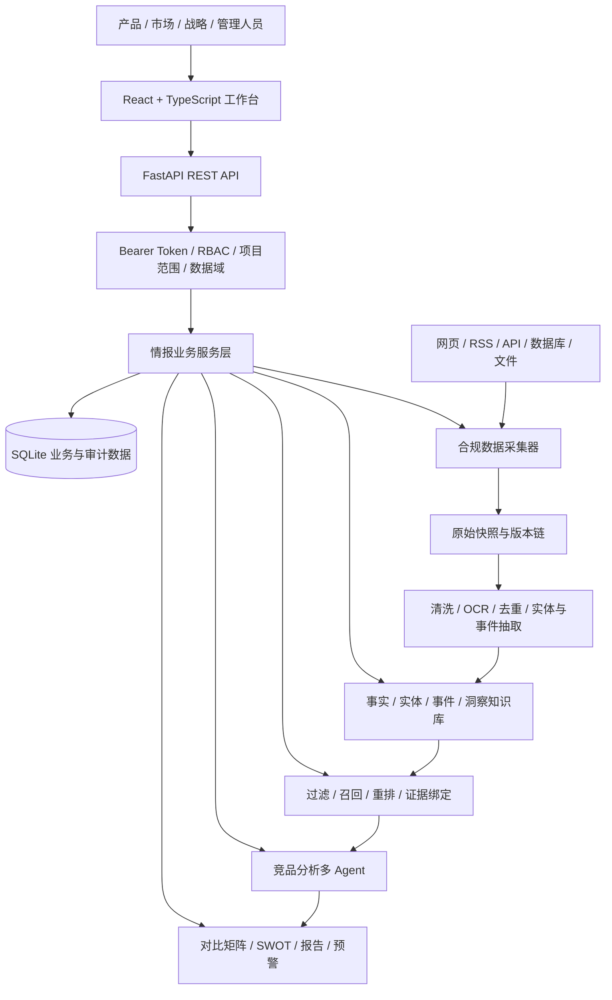
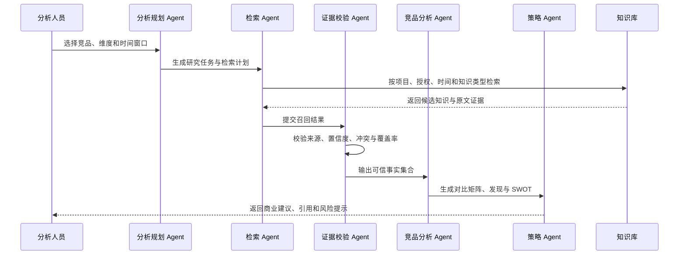

# 镜观 Agent 竞品分析系统

<div align="center">


**基于 React + FastAPI + RAG + 多 Agent 的证据化竞品情报分析平台**

[项目简介](#项目简介) · [核心亮点](#核心亮点) · [技术架构](#技术架构) · [功能模块](#功能模块) · [快速启动](#快速启动) · [接口概览](#接口概览)

</div>

---

## 项目简介

镜观是一套面向产品、市场、战略和管理团队的 Agent 竞品分析系统。平台覆盖外部数据采集、任务调度、内容清洗、知识沉淀、证据检索、竞品分析、报告交付、预警处置和安全运维，形成从原始信息到商业洞察的完整闭环。

用户可以配置网页、RSS、公开 API、数据库和本地文件等数据源，通过调度与 Agent 工作流持续采集竞品信息；系统对材料执行正文提取、OCR、去重、实体识别和事件抽取，并将可信事实写入带来源、版本、原文位置和置信度的知识库。

分析阶段采用证据约束的 RAG 与多 Agent 流程，依次完成任务规划、知识检索、证据校验、对比分析和策略建议。证据不足时系统会明确拒绝补写，避免把推测包装成事实。

### 项目价值

- 完整情报闭环：采集、处理、存储、检索、分析、报告和预警统一管理。
- 证据可追溯：结论关联来源、材料版本、原文位置、抽取方式和置信度。
- 多 Agent 编排：将复杂竞品研究拆分为可观察、可恢复的分析步骤。
- 企业级治理：提供 RBAC、MFA、项目范围、数据域、审计和模型预算管理。
- 多格式交付：支持在线报告、审批流以及 Word/PDF 文件导出。
- 合规采集边界：默认阻止私网访问，不绕过登录、验证码、付费墙或 robots 限制。

### 界面预览



---

## 核心亮点

### 业务能力

- 多项目工作台展示情报数量、趋势、来源健康度、待复核任务和最新洞察。
- 支持静态网页、动态网页、RSS/Atom、只读 JSON API、公开数据库和文件上传。
- 支持立即、定时、事件和 API 触发，并提供重试、超时、限速、并发及熔断策略。
- 支持正文提取、噪声清理、语言识别、OCR、精确/近似去重、实体与事件抽取。
- 提供分层知识存储、统一检索、证据链下钻、人工复核和专题集合。
- 提供证据化 RAG 问答、竞品对比矩阵、SWOT、商业建议和历史分析版本。
- 提供日报、周报、产品对比、竞品快讯、专题研究和高管摘要模板。
- 提供报告订阅、信号合并、影响分级、静默期、升级时限和预警处置。

### 技术能力

- FastAPI + SQLite 提供真实 REST API、持久化和自动演示数据初始化。
- React + TypeScript + Ant Design 构建单页竞品情报工作台。
- Playwright 调用 Edge/Chromium 采集需要浏览器渲染的动态页面。
- SHA-256 内容指纹与 URL 版本链保留原始材料的完整历史。
- RAG 使用中英文词项扩展、字段权重、置信度和复核状态进行重排。
- Agent 分析结果区分事实与推断，记录引用覆盖率、样本量和执行轨迹。
- HMAC 签名 Bearer Token、角色权限、项目范围和数据域共同完成访问控制。
- 报告导出使用 python-docx 与 ReportLab 生成真实 Word/PDF 文件。

---

## 技术架构

### 后端技术栈

| 技术 | 版本/说明 | 用途 |
| --- | --- | --- |
| Python | 3.11+ | 后端运行环境 |
| FastAPI | 0.115+ | REST API 与 OpenAPI 文档 |
| Uvicorn | 0.30+ | ASGI 开发与生产服务 |
| SQLite | 内置 | 项目、材料、知识、报告和审计数据持久化 |
| HTTPX | 0.27+ | 合规 HTTP 数据采集 |
| Beautiful Soup | 4.12+ | HTML 解析与正文提取 |
| Playwright | 1.50+ | 动态网页浏览器渲染 |
| Feedparser | 6.x | RSS/Atom 订阅解析 |
| PyPDF / python-docx / openpyxl | 多格式解析 | PDF、DOCX、XLSX 文件处理 |
| ReportLab / python-docx | 文档导出 | PDF 与 Word 报告生成 |
| Pytest | 8+ | 后端接口与业务测试 |

### 前端技术栈

| 技术 | 版本/说明 | 用途 |
| --- | --- | --- |
| React | 19.2 | 前端组件与交互 |
| TypeScript | 5.9 | 类型约束与接口契约 |
| Vinext | 0.0.50 | React 服务端渲染与构建 |
| Vite | 8.0 | 开发服务器与构建工具 |
| Ant Design | 6.5 | 工作台 UI 组件 |
| ECharts | 6.1 | 情报趋势与运营指标可视化 |
| Drizzle ORM | 0.45 | Cloudflare D1 扩展能力 |
| Cloudflare Workers | 可选部署 | 前端边缘运行环境 |

### 系统架构图



### 竞品分析 Agent 流程



---

## 项目结构

```text
jingguan-competitive-intelligence/
├─ backend                              # FastAPI 后端服务
│  ├─ app
│  │  ├─ auth.py                        # Token 认证与校验
│  │  ├─ collector.py                   # 多类型合规采集器
│  │  ├─ competitive_agent.py           # 竞品分析 Agent
│  │  ├─ config.py                      # 环境与运行配置
│  │  ├─ database.py                    # SQLite 建表、迁移与演示数据
│  │  ├─ main.py                        # API 路由与应用入口
│  │  ├─ processing.py                  # 清洗、OCR、去重与抽取
│  │  ├─ rag.py                         # 检索、重排与证据化回答
│  │  ├─ report_exports.py              # Word/PDF 报告导出
│  │  ├─ schemas.py                     # Pydantic 请求响应模型
│  │  └─ services.py                    # 核心业务服务
│  ├─ tests                             # 后端接口测试
│  ├─ requirements.txt                  # 运行依赖
│  └─ requirements-dev.txt              # 开发与测试依赖
│
├─ frontend                             # React + TypeScript 工作台
│  ├─ app
│  │  ├─ components                     # 十大业务模块组件
│  │  ├─ lib/api.ts                     # FastAPI 请求与类型封装
│  │  ├─ globals.css                    # 全局视觉样式
│  │  ├─ layout.tsx                     # 应用布局与元数据
│  │  └─ page.tsx                       # 工作台入口
│  ├─ public                            # 图标与项目预览图
│  ├─ tests                             # 服务端渲染与接口契约测试
│  ├─ worker                            # Cloudflare Worker 入口
│  ├─ package.json                      # 前端依赖与脚本
│  └─ vite.config.ts                    # Vite、代理和部署配置
│
├─ Agent竞品分析系统_产品需求文档_V1.0_最终版.docx
└─ README.md
```

---

## 功能模块

| 模块 | 主要能力 | 对应实现 |
| --- | --- | --- |
| 综合工作台 | 项目切换、指标卡片、趋势、洞察、复核与快捷报告 | `Workbench.tsx` |
| 数据源管理 | 来源配置、授权检查、健康状态、调度和凭据轮换 | `DataSourceManagement.tsx` |
| 数据采集 | 采集任务、日志、失败重试、原始材料和文件上传 | `CollectionCenter.tsx` |
| 任务编排 | 触发策略、Agent 节点、超时重试、熔断与异常恢复 | `TaskOrchestration.tsx` |
| 数据处理 | 正文提取、OCR、去重、实体/事件抽取和质量复核 | `DataProcessing.tsx` |
| 知识存储 | 三层存储、证据链、复核版本和专题集合 | `KnowledgeStorage.tsx` |
| 检索与 RAG | 组合过滤、召回重排、引用抽屉和检索轨迹 | `RetrievalRAG.tsx` |
| 竞品分析 Agent | 对比矩阵、事实/推断、SWOT、建议和历史版本 | `CompetitiveAnalysis.tsx` |
| 报告与预警 | 模板报告、审批、导出、订阅、预警确认与处置 | `ReportAlertCenter.tsx` |
| 管理与运维 | RBAC、MFA、模型预算、评测、审计、事故和备份 | `AdminSecurityOperations.tsx` |

### 支持的数据源与文件

| 类型 | 支持范围 | 说明 |
| --- | --- | --- |
| 静态网页 | HTML 页面 | 正文选择器、内容指纹与版本链 |
| 动态网页 | Edge / Chromium | 等待选择器、渲染等待时间和浏览器通道 |
| RSS/Atom | 标准订阅源 | 限制最大条目数并保留发布时间 |
| 公开 API | 只读 JSON API | 只允许 GET，可配置字段路径 |
| 公开数据库 | 受控只读来源 | 通过来源策略和数据域限制访问 |
| 文本与办公文件 | TXT、MD、HTML、JSON、CSV、XML、PDF、DOCX、XLSX | 提取正文和结构化字段 |
| 图片 | PNG、JPEG、WebP、TIFF、BMP | 可通过 Tesseract 执行 OCR |

---

## 数据与知识模型

系统使用 SQLite 保存业务数据，并按职责将核心表划分为以下几组：

| 数据域 | 核心表 | 说明 |
| --- | --- | --- |
| 组织与权限 | `organizations`、`users`、`roles`、`user_memberships` | 组织、成员、角色和访问范围 |
| 项目与指标 | `projects`、`project_metrics`、`trend_points` | 项目配置、工作台指标与趋势 |
| 来源与采集 | `data_sources`、`source_health`、`source_runs` | 来源配置、健康检查和任务运行 |
| 原始材料 | `collection_documents`、`document_processing` | 原始快照、版本和处理结果 |
| 知识与证据 | `knowledge_items`、`knowledge_revisions`、`evidence` | 事实、实体、事件、修订和原文证据 |
| 分析与检索 | `rag_query_logs`、`competitive_analysis_runs`、`insights` | RAG 轨迹、Agent 结果和洞察 |
| 报告与预警 | `reports`、`report_templates`、`alert_rules`、`alerts` | 报告生命周期、订阅与预警 |
| 治理与运维 | `audit_events`、`model_configs`、`incidents`、`backup_runs` | 审计、模型、事故与备份 |

首次启动后端时，系统会自动创建 `backend/data/jinguan.db` 并填充与工作台一致的演示数据。数据库文件已被 Git 忽略，不会上传到仓库。

---

## 快速启动

### 环境要求

| 环境 | 建议版本 | 说明 |
| --- | --- | --- |
| Python | 3.11+ | FastAPI 后端运行环境 |
| Node.js | 22.13+ | 前端开发和构建 |
| Microsoft Edge | 当前稳定版 | 动态网页采集默认浏览器 |
| Tesseract | 可选 | 图片与扫描件 OCR |
| Poppler | 可选 | 扫描 PDF 转图片时提供 `pdftoppm` |

### 1. 启动后端

```powershell
cd backend
python -m venv .venv
.\.venv\Scripts\python.exe -m pip install -r requirements-dev.txt
Copy-Item .env.example .env
.\.venv\Scripts\python.exe -m uvicorn app.main:app --reload --port 8000
```

后端地址：

```text
http://127.0.0.1:8000
```

接口文档：

```text
http://127.0.0.1:8000/docs
```

健康检查：

```powershell
Invoke-RestMethod http://127.0.0.1:8000/health
```

### 2. 启动前端

另开一个 PowerShell 终端：

```powershell
cd frontend
npm.cmd install
Copy-Item .env.example .env.local
npm.cmd run dev
```

前端端口以终端输出为准，开发环境会自动把 `/api` 和 `/health` 代理到 `http://127.0.0.1:8000`。

### 3. 安装备用 Chromium

默认动态网页采集器调用本机 Microsoft Edge。部署环境没有 Edge 时，可安装 Playwright Chromium：

```powershell
cd backend
.\.venv\Scripts\python.exe -m playwright install chromium
```

---

## 配置说明

### 后端环境变量

复制 `backend/.env.example` 为 `backend/.env` 后按需修改：

| 变量 | 默认值/示例 | 说明 |
| --- | --- | --- |
| `APP_ENV` | `development` | 运行环境 |
| `DATABASE_PATH` | `./data/jinguan.db` | SQLite 数据库路径 |
| `CORS_ORIGINS` | 本地 3000/5173 端口 | 允许访问 API 的前端来源 |
| `AUTH_SECRET` | 至少 32 个随机字符 | 生产环境 Token 签名密钥 |
| `AUTH_TOKEN_TTL_MINUTES` | `60` | 登录令牌有效时间 |
| `ALLOW_LEGACY_USER_HEADER` | `true` | 仅开发/测试兼容本地用户头 |
| `COLLECTOR_MAX_RESPONSE_BYTES` | `5242880` | 单次采集响应体积上限 |
| `COLLECTOR_ALLOW_PRIVATE_NETWORKS` | `false` | 是否允许采集私网地址 |
| `SCHEDULER_MAX_CONCURRENCY` | `4` | 调度器最大并发数 |
| `OCR_ENABLED` | `true` | 是否启用 OCR |
| `OCR_LANGUAGES` | `chi_sim+eng` | Tesseract 语言包 |
| `NEAR_DUPLICATE_THRESHOLD` | `0.82` | 近似去重阈值 |

生产环境必须设置安全的 `AUTH_SECRET`，并关闭开发兼容入口。非公开来源的密钥应通过运行环境提供，数据库与 API 只保存凭据引用和掩码，不保存明文密钥。

### 前端环境变量

配置文件：`frontend/.env.local`

```text
NEXT_PUBLIC_API_BASE_URL=
NEXT_PUBLIC_AUTH_TOKEN=
```

- 本地代理模式下 `NEXT_PUBLIC_API_BASE_URL` 保持为空。
- 前后端独立部署时，将其设置为 FastAPI 的公开地址，不要带末尾 `/`。
- 生产环境的 `NEXT_PUBLIC_AUTH_TOKEN` 应由组织身份服务签发。

---

## 接口概览

### 系统与工作台

| 接口 | 方法 | 说明 |
| --- | --- | --- |
| `/health` | GET | 服务健康检查 |
| `/api/v1/workbench` | GET | 工作台指标、趋势和洞察 |
| `/api/v1/projects` | GET/POST | 项目列表与项目创建 |
| `/api/v1/insights/{id}` | GET | 洞察详情与证据链 |
| `/api/v1/reviews/{id}/claim` | POST | 领取人工复核任务 |

### 来源、采集与处理

| 接口 | 方法 | 说明 |
| --- | --- | --- |
| `/api/v1/sources` | GET/POST | 来源查询与创建 |
| `/api/v1/sources/{id}` | PATCH/DELETE | 更新或归档来源 |
| `/api/v1/sources/{id}/checks` | POST | 授权、robots 与连接检查 |
| `/api/v1/sources/{id}/runs` | POST | 立即触发来源采集 |
| `/api/v1/orchestration` | GET | 调度和 Agent 编排状态 |
| `/api/v1/orchestration/triggers` | POST | 创建立即、定时或事件任务 |
| `/api/v1/collection/runs` | GET | 采集任务列表 |
| `/api/v1/collection/documents` | GET | 原始材料列表 |
| `/api/v1/collection/files` | POST | 上传文件并创建采集材料 |
| `/api/v1/processing` | GET | 处理队列与质量状态 |
| `/api/v1/processing/jobs` | POST | 批量创建处理任务 |

### 知识、RAG 与竞品分析

| 接口 | 方法 | 说明 |
| --- | --- | --- |
| `/api/v1/knowledge` | GET | 知识条目组合检索 |
| `/api/v1/knowledge/items/{id}` | GET | 知识详情和原文证据 |
| `/api/v1/knowledge/items/{id}/review` | PATCH | 更新知识复核状态 |
| `/api/v1/knowledge/collections` | POST | 创建专题集合 |
| `/api/v1/search` | GET | 统一关键词搜索 |
| `/api/v1/rag/query` | POST | 证据约束的 RAG 问答 |
| `/api/v1/competitive-analysis` | GET | 竞品分析配置与历史 |
| `/api/v1/competitive-analysis/runs` | POST | 启动竞品分析 Agent |

### 报告、预警与管理

| 接口 | 方法 | 说明 |
| --- | --- | --- |
| `/api/v1/reports/generate` | POST | 根据模板生成报告 |
| `/api/v1/reports` | GET | 报告列表 |
| `/api/v1/reports/{id}/approval` | POST | 审批或退回报告 |
| `/api/v1/reports/{id}/export` | GET | 导出 Word/PDF 报告 |
| `/api/v1/report-subscriptions/{id}` | PATCH | 更新报告订阅 |
| `/api/v1/alert-rules` | POST | 创建预警规则 |
| `/api/v1/alert-rules/{id}` | PATCH | 修改预警规则 |
| `/api/v1/alerts/{id}/actions` | POST | 确认、处置或关闭预警 |
| `/api/v1/admin` | GET | 管理、安全与运维总览 |
| `/api/v1/admin/users/{id}/access` | PATCH | 更新用户角色与范围 |
| `/api/v1/admin/models/{id}` | PATCH | 更新模型、预算和降级配置 |
| `/api/v1/admin/backups` | POST | 创建并校验 SQLite 备份 |

完整接口定义和可交互调试页面请访问 `http://127.0.0.1:8000/docs`。

---

## 开发与验证

### 后端测试

```powershell
cd backend
.\.venv\Scripts\python.exe -m pytest
```

### 前端检查与构建

```powershell
cd frontend
npm.cmd run lint
npm.cmd test
```

`npm.cmd test` 会先完成 Vinext 生产构建，再验证服务端首屏渲染和 FastAPI 接口契约。

### 常用排查命令

```powershell
# 检查本地服务端口
Get-NetTCPConnection -LocalPort 5173,8000 -State Listen

# 后端健康检查
Invoke-RestMethod http://127.0.0.1:8000/health

# 查看 Git 工作区状态
git status -sb
```

---

## 安全与合规说明

- 生产环境所有 `/api/v1` 接口必须使用签名 Bearer Token。
- 开发环境的 `X-User-Id` 兼容入口在生产模式下始终关闭。
- 数据源普通删除采用可审计归档，永久清除需要管理员权限和精确确认值。
- 采集器默认禁止本机、私网、链路本地和保留地址，公开 API 仅允许 GET。
- 系统不会绕过登录、验证码、付费墙或 robots 禁止规则。
- 原始快照保持只读，重新处理仅生成新的独立处理结果和知识修订。
